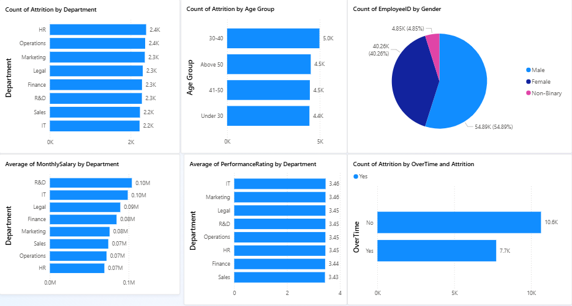

# HR Analytics Dashboard 📊

An end-to-end HR Analytics project built using Python, SQL, Power BI, Machine Learning, and AI on a 1,00,000+ row dataset.

> Developed with AI assistance — industry standard practice

---

## 🚀 Project Overview

This project analyzes employee data to uncover key HR insights including attrition trends, salary benchmarks, performance ratings, and more. It also includes a Machine Learning model to predict employee attrition and an AI-powered sentiment analyzer for employee feedback.

---

## 🛠️ Tech Stack

| Tool | Purpose |
|------|---------|
| Python (pandas, numpy) | Data Generation & Analysis |
| SQLite + DBeaver | SQL Analysis |
| scikit-learn | ML Attrition Prediction |
| Groq Llama API | AI Sentiment Analysis |
| fpdf2 | Automated PDF Report |
| Power BI | Interactive Dashboard |

---

## 📁 Project Structure

```
HR-Analytics-Dashboard/
│
├── generate_hr_data.py       # Generate 1,00,000 row synthetic dataset
├── hr_attrition_model.py     # ML model - Random Forest attrition prediction
├── hr_sentiment.py           # AI sentiment analysis using Groq Llama API
├── hr_report_generator.py    # Automated PDF report generator
├── HR_Analysis_Queries.sql   # 6 SQL queries with insights
├── .env.example              # API key template
├── .gitignore                # Git ignore file
└── README.md                 # Project documentation
```

---

## 📊 Dataset

- **Rows:** 1,00,000 employees
- **Columns:** 21 features
- **Generated using:** Python (pandas, numpy, faker)

**Columns:** EmployeeID, Age, Gender, MaritalStatus, Education, Department, JobRole, Company, Location, HireYear, YearsAtCompany, ExperienceYears, MonthlySalary, PerformanceRating, JobSatisfaction, WorkLifeBalance, OverTime, TrainingHoursPerYear, LeavesTaken, Promotions, Attrition

---

## 🔍 SQL Analysis — Key Insights

| # | Analysis | Key Finding |
|---|----------|-------------|
| 1 | Attrition by Department | HR has highest attrition (2,380) |
| 2 | Avg Salary by Department | R&D highest (₹1,04,051), HR lowest (₹69,163) |
| 3 | Age Group Attrition | 30-40 age group highest (27.1%) |
| 4 | Performance by Department | All departments similar (3.43-3.46) |
| 5 | Gender Diversity | Male 55%, Female 40%, Non-Binary 5% |
| 6 | Overtime vs Attrition | Overtime = 22.1% vs No Overtime = 16.4% |

---

## 🤖 Machine Learning Model

- **Algorithm:** Random Forest Classifier
- **Train/Test Split:** 80/20
- **Accuracy:** 80.75%

**Feature Importance (Top 3):**
1. Monthly Salary — 22.7%
2. Training Hours — 18.7%
3. Age — 14.7%

---

## 💬 AI Sentiment Analysis

Used **Groq Llama API** to analyze employee feedback and classify sentiment as Positive, Negative, or Neutral.

---

## 📈 Power BI Dashboard

6 interactive charts:
- Attrition by Department
- Average Salary by Department
- Age Group Attrition
- Performance by Department
- Gender Diversity (Pie Chart)
- Overtime vs Attrition
## 📸 Dashboard Preview

---

## ⚙️ Setup & Run

**1. Install dependencies:**
```bash
pip install pandas numpy faker scikit-learn groq python-dotenv fpdf2 openpyxl
```

**2. Setup API Key:**
```bash
# Copy .env.example to .env
cp .env.example .env
# Add your Groq API key in .env file
GROQ_API_KEY=your_key_here
```

**3. Run scripts:**
```bash
# Generate dataset
python generate_hr_data.py

# Run ML model
python hr_attrition_model.py

# Run sentiment analysis
python hr_sentiment.py

# Generate PDF report
python hr_report_generator.py
```

---

## 👤 Author

**Sangdil**
- 📧 sangdilku246749@gmail.com
- 📍 Dehradun, Uttarakhand
